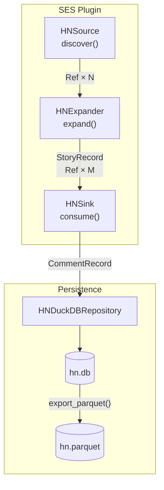
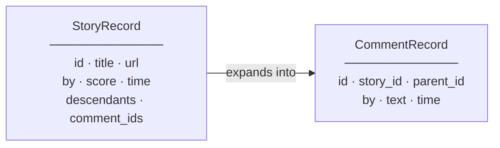

# ladon-hackernews

[](https://github.com/MoonyFringers/ladon-hackernews/actions/workflows/test.yml)
[](LICENSE)

Hacker News adapter for the [Ladon](https://github.com/MoonyFringers/ladon) crawler framework.

Crawls the HN top-stories list, expands each story into its direct comments,
and persists everything to a DuckDB database — ready to export as Parquet for
LLM training pipelines or downstream analysis.

## Quick start

```bash
# Install Ladon core (until ladon-crawl lands on PyPI, install from source)
pip install git+https://github.com/MoonyFringers/ladon.git
pip install git+https://github.com/MoonyFringers/ladon-hackernews.git
ladon-hackernews --top 30 --out hn.db
```

No authentication. No external server.

## What you get

Each run writes two tables to `hn.db`:

**`hn_comments`** — one row per HN comment (the leaf record):

| column | type | description |
|---|---|---|
| `id` | INTEGER | HN comment ID |
| `story_id` | INTEGER | Parent story ID |
| `parent_id` | INTEGER | Immediate parent (story or comment) |
| `by` | TEXT | Author username |
| `text` | TEXT | Raw HTML comment body |
| `time` | TIMESTAMPTZ | Comment timestamp (UTC) |
| `run_id` | TEXT | UUID of the crawl run that wrote this row |

**`ladon_runs`** — one row per story crawled (upserted twice: at start and finish):

| column | type | description |
|---|---|---|
| `run_id` | TEXT | UUID for this crawl run |
| `plugin_name` | TEXT | Always `"hackernews"` |
| `top_ref` | TEXT | HN item URL that was the root of this run |
| `started_at` | TIMESTAMPTZ | When the run started (UTC) |
| `finished_at` | TIMESTAMPTZ | When the run finished; NULL while running |
| `status` | TEXT | `done`, `partial`, `not_ready`, `failed`, or `running` |
| `leaves_fetched` | INTEGER | Comments for which `sink.consume()` succeeded |
| `leaves_persisted` | INTEGER | Comments successfully written to `hn_comments` |
| `leaves_failed` | INTEGER | Comments that failed to fetch or persist |
| `branch_errors` | INTEGER | Expander-level errors (branch could not be expanded) |
| `errors` | TEXT | JSON array of error message strings |

### Sample DuckDB query

```sql
-- Top commenters across all crawled stories
SELECT "by", COUNT(*) AS comments
FROM hn_comments
GROUP BY "by"
ORDER BY comments DESC
LIMIT 10;
```

## Export to Parquet

```python
from ladon_hackernews import export_parquet

export_parquet("hn.db", "hn.parquet")
```

## LLM training pipeline

```
ladon-hackernews --top 500 --out hn.db
    → export_parquet("hn.db", "hn.parquet")
        → training pipeline
```

HN comments are structured, human-authored, and high signal-to-noise —
a useful corpus for instruction tuning and dialogue modelling.

## How it works

This adapter implements the Ladon [SES (Source / Expander / Sink)](https://github.com/MoonyFringers/ladon/blob/main/docs/decisions/adr-004-ses-protocol-design.md) protocol against the [HN Firebase API](https://github.com/HackerNews/API).

### Pipeline



### Domain records



### SES class map

| Layer | Class | HN API call |
|---|---|---|
| `Source` | `HNSource` | `GET /v0/topstories.json` → story ID list |
| `Expander` | `HNExpander` | `GET /v0/item/{story_id}.json` → comment refs |
| `Sink` | `HNSink` | `GET /v0/item/{comment_id}.json` → `CommentRecord` |

`HNDuckDBRepository` implements both `Repository` (leaf persistence) and
`RunAudit` (run history) from [`ladon.persistence`](https://github.com/MoonyFringers/ladon/blob/main/docs/decisions/adr-006-persistence-layer.md)
— structurally, with no Ladon base class imported.

Each story is one independent run. The run audit trail lets you resume from
the last successful crawl:

```python
last = repo.get_last_run("hackernews")  # most recent "done" run
```

## Use as a library

```python
import uuid
from datetime import datetime, timezone

from ladon.networking.client import HttpClient
from ladon.networking.config import HttpClientConfig
from ladon.persistence import RunAudit, RunRecord
from ladon.plugins.errors import ExpansionNotReadyError
from ladon.plugins.models import Ref
from ladon.runner import RunConfig, run_crawl
from ladon_hackernews import HNPlugin, HNDuckDBRepository

plugin = HNPlugin(top=10)
config = RunConfig()
client_config = HttpClientConfig(user_agent="my-bot/1.0")

with HNDuckDBRepository("hn.db") as repo, HttpClient(client_config) as client:
    for story_ref in plugin.source.discover(client):
        if not isinstance(story_ref, Ref):
            raise TypeError(f"unexpected type {type(story_ref).__name__}")
        run_id = str(uuid.uuid4())
        run = RunRecord(
            run_id=run_id,
            plugin_name=plugin.name,
            top_ref=story_ref.url,
            started_at=datetime.now(tz=timezone.utc),
            status="running",
        )
        if isinstance(repo, RunAudit):
            repo.record_run(run)

        try:
            result = run_crawl(
                story_ref, plugin, client, config,
                # Default-argument capture binds run_id to each lambda.
                on_leaf=lambda rec, _, _id=run_id: repo.write_leaf(rec, _id),
            )
            run.status = "partial" if result.leaves_failed else "done"
            run.leaves_fetched = result.leaves_fetched
            run.leaves_persisted = result.leaves_persisted
            run.leaves_failed = result.leaves_failed
            run.branch_errors = sum(
                1 for e in result.errors if e.startswith("expander branch")
            )
            run.errors = result.errors
        except ExpansionNotReadyError:
            run.status = "not_ready"
        except Exception as exc:
            run.status = "failed"
            run.errors = (str(exc),)
        finally:
            run.finished_at = datetime.now(tz=timezone.utc)
            if isinstance(repo, RunAudit):
                repo.record_run(run)
```

## Writing your own adapter

`ladon-hackernews` is the canonical reference for building a Ladon adapter.
See the [Ladon documentation](https://github.com/MoonyFringers/ladon) and
[ADR-003](https://github.com/MoonyFringers/ladon/blob/main/docs/decisions/adr-003-plugin-adapter-interface.md)
for the full adapter authoring guide.

Key pattern: adapters implement Ladon protocols **structurally** — no
inheritance from any Ladon base class is required. Only `RunRecord` needs
to be imported for `RunAudit` implementations.

## Development

```bash
git clone https://github.com/MoonyFringers/ladon-hackernews
cd ladon-hackernews

# Install Ladon core (not yet on PyPI as ladon-crawl — use git source)
pip install git+https://github.com/MoonyFringers/ladon.git

# Install this package and dev dependencies.
# ladon-crawl is not yet on PyPI, so skip automatic dep resolution and
# install the remaining non-ladon deps explicitly.
pip install -e ".[dev]" --no-deps
# Version floors below must match [project.dependencies] in pyproject.toml.
pip install "duckdb>=1.0.0" "pytz>=2023.3"

pre-commit install
pytest tests/ -v
```

See [CONTRIBUTING.md](CONTRIBUTING.md) for full guidelines.

## License

Apache-2.0 — see [LICENSE](LICENSE).

The [Ladon](https://github.com/MoonyFringers/ladon) core framework is
AGPL-3.0-or-later. `ladon-hackernews` is Apache-2.0 but has a runtime
dependency on Ladon core; review the AGPL terms if you plan to distribute
or run this as a network service.
